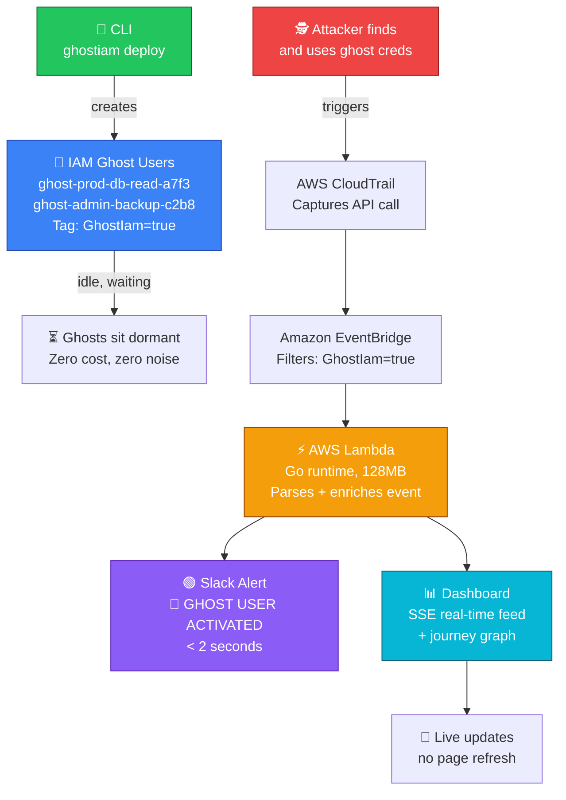
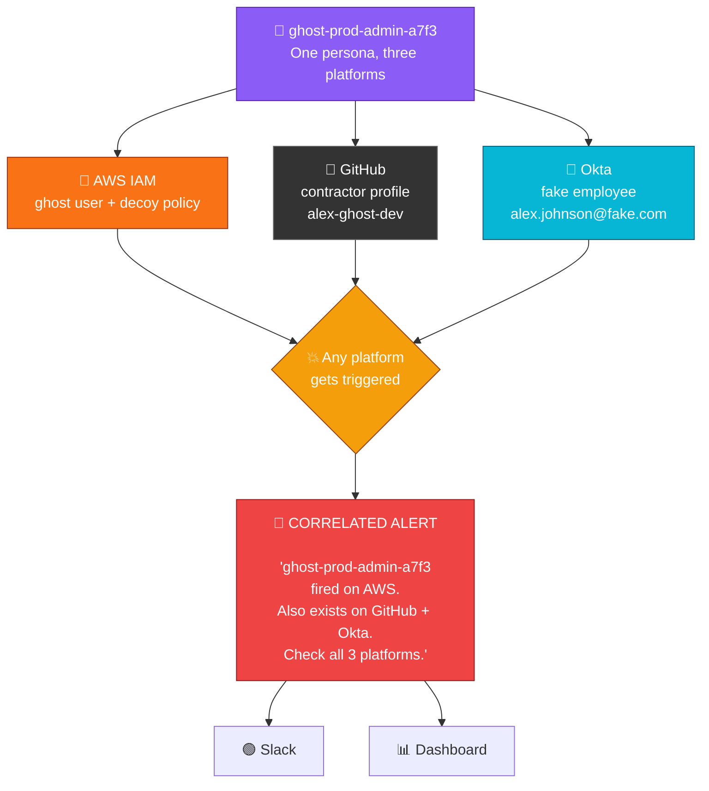
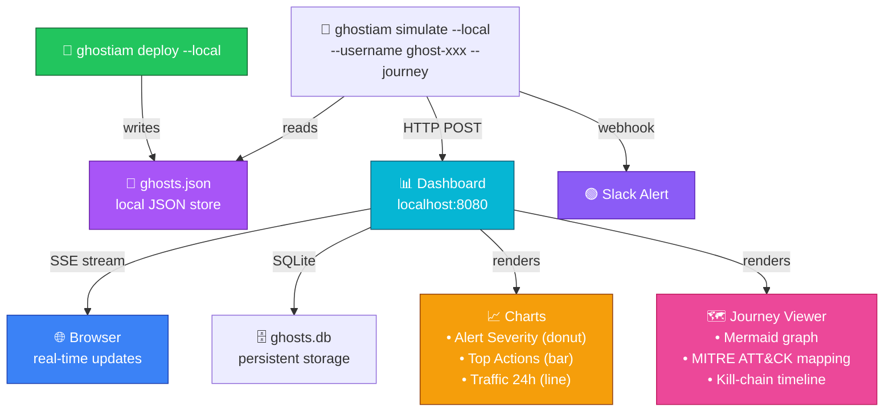
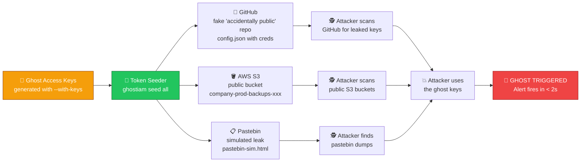
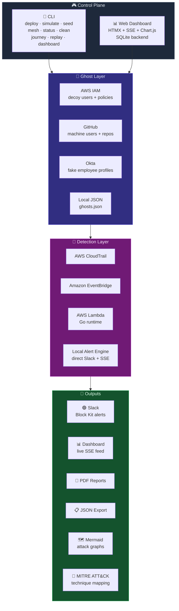

# 👻 GhostIam

**Ghost users. Real alerts. Zero false positives.**

GhostIam deploys decoy IAM identities across your AWS account that look like privileged credentials. Nobody legitimate ever touches them — so the instant an attacker enumerates or uses one during reconnaissance, CloudTrail fires a Slack alert within seconds, backed by a full MITRE ATT&CK-mapped kill chain.

[](https://go.dev)
[](LICENSE)
[](https://github.com/kakashi-kx/ghostiam/releases)
[](CONTRIBUTING.md)
[](SECURITY.md)

<p align="center">
  
</p>

---

## Why GhostIam

Most detection rules chase behavior — anomalous logins, unusual API volume, impossible travel — and all of that produces noise. GhostIam flips the model: it plants identities that **have no legitimate reason to ever be touched**. There's no baseline to tune, no threshold to calibrate. If a ghost user's key is used, or a ghost username shows up in an `iam:List*` call, that's not "suspicious" — it's an attacker.

- **Zero false positives.** A ghost identity has no owner, no CI job, no scheduled task referencing it. Any touch is signal.
- **Deception that survives scrutiny.** Ghost users carry realistic decoy IAM policies — an attacker who finds the keys believes they've struck gold, right up until every action they take is logged and alerted on.
- **Detection in seconds, not a SIEM query away.** CloudTrail → EventBridge → Lambda → Slack, with no polling.

## What's inside

| Layer | What it does |
|---|---|
| **Ghost Deploy** | Creates decoy IAM users (AWS or `--local` JSON store) tagged and named to look like real privileged accounts |
| **Detection Pipeline** | Terraform-deployed Lambda + EventBridge rule that catches any CloudTrail event from a ghost identity and posts to Slack in seconds |
| **Token Seeder** | Auto-"leaks" ghost keys to realistic bait — public GitHub repos, public S3 buckets, Pastebin-style dumps |
| **Ghost Mesh** | Deploys one persona across AWS IAM + GitHub + Okta, so a fire on any platform correlates and flags the whole identity |
| **Journey Replay** | Turns a fired ghost into a MITRE ATT&CK-mapped kill chain — Mermaid graph, risk score, full timeline |
| **Web Dashboard** | Real-time ops console (Go + HTMX + SQLite + Chart.js) with live SSE-streamed alerts, journey visualization, and a REST API |

<table>
<tr>
<td width="50%">

<p align="center"><sub>Attacker journey — kill chain reconstructed with MITRE ATT&CK mapping</sub></p>
</td>
<td width="50%">

<p align="center"><sub>Same journey, rendered as a Mermaid flow diagram</sub></p>
</td>
</tr>
</table>

## Quickstart (5 minutes, no AWS required)

```bash
# 1. Clone and build
git clone https://github.com/kakashi-kx/ghostiam
cd ghostiam
make build

# 2. Deploy ghost users locally (no AWS account needed to try it)
./build/ghostiam deploy --local --count 5 --with-keys

# 3. Simulate an attacker touching one
./build/ghostiam simulate --local --username ghost-prod-db-read-a7f3c2 --journey

# 4. Watch it live
./build/ghostiam dashboard --port 8080 --api-key demo-key
# open http://localhost:8080
```

### Going live in a real AWS account

```bash
export SLACK_WEBHOOK_URL="https://hooks.slack.com/..."
make deploy-lambda                                   # Terraform: Lambda + EventBridge + IAM role
./build/ghostiam deploy --count 20 --prefix prod      # real decoy IAM users
./build/ghostiam simulate --username ghost-prod-db-read-a7f3c2   # trigger + verify Slack alert
```

> CloudTrail must be enabled — it's on by default in every AWS account, so this typically works with zero extra setup.


## Architecture

### Detection Flow — AWS Mode



### Attack Journey — Kill Chain Visualization

```mermaid
flowchart LR
    subgraph RECON["🔍 RECONNAISSANCE"]
        S1["sts:GetCallerIdentity<br/>Who am I?"]
    end
    
    subgraph DISCOVERY["📋 DISCOVERY"]
        S2["iam:ListRoles<br/>What can I access?"]
        S3["s3:ListBuckets<br/>Where's the data?"]
    end
    
    subgraph ACCESS["📥 DATA ACCESS"]
        S4["s3:GetObject<br/>Exfiltrate data"]
    end
    
    subgraph PERSIST["🔑 PERSISTENCE"]
        S5["iam:CreateAccessKey<br/>Plant backdoor"]
    end
    
    S1 -->|"T1087.004"| S2
    S2 -->|"T1069.002"| S3
    S3 -->|"T1526"| S4
    S4 -->|"T1530"| S5
    
    S5 -.->|"🚨 GHOST TRIGGERED<br/>Risk: 10/10 CRITICAL"| ALERT["🟢 Slack + 📊 Dashboard"]
    
    style RECON fill:#f9f9ff,stroke:#6366f1,color:#1e1b4b
    style DISCOVERY fill:#fef3c7,stroke:#d97706,color:#78350f
    style ACCESS fill:#fee2e2,stroke:#dc2626,color:#7f1d1d
    style PERSIST fill:#fce7f3,stroke:#db2777,color:#831843
    style ALERT fill:#ef4444,stroke:#991b1b,color:#fff
```



### Cross-Platform Ghost Mesh



### Local Mode — Zero AWS Dependencies



### Token Seeder — Bait Distribution



### Full Platform Overview




---


## Web Dashboard

Serve the operations console with `ghostiam dashboard --port 8080 --api-key <key>`. Every page is authenticated with a shared API key (cookie, `?api_key=`, or `X-API-Key` header) and updates live over Server-Sent Events — no polling, no refresh.


| Page | What it shows |
|---|---|
| **Dashboard** | Live stat cards, alert traffic by hour, severity donut, top actions, live alert feed |
| **Ghosts** | Deploy/archive decoys from the browser, inspect keys and attached policies |
| **Alerts** | Full alert feed with severity badges, source IPs, and a one-click alert simulator |
| **Journeys** | Attack kill-chains as step timelines with MITRE tactics and Mermaid flow diagrams |
| **Mesh** | Correlated personas shown as platform-leg cards (AWS / GitHub / Okta) |
| **Seeds** | Bait locations, keys, and files — recorded automatically or by hand |

```bash
export GHOSTIAM_DASHBOARD_URL=http://localhost:8080
export GHOSTIAM_DASHBOARD_KEY=demo-key
ghostiam simulate --local --username ghost-...   # pushes an alert to the dashboard
ghostiam seed pastebin --ghost-user ghost-...    # pushes a seed
ghostiam journey --username ghost-...            # pushes a journey
```

Reports export via `/reports/export?format=json|pdf`. A REST API is exposed at `/api/v1/stats|ghosts|alerts|journeys`.

## Commands

### `ghostiam deploy`

Deploy ghost IAM users into your AWS account (or `ghosts.json` with `--local`).

| Flag | Shorthand | Default | Description |
|---|---|---|---|
| `--count` | `-c` | `10` | Number of ghost users to create |
| `--prefix` | `-p` | `prod` | Name prefix (e.g. `ghost-prod-...`) |
| `--region` | `-r` | `us-east-1` | AWS region |
| `--with-keys` | | `false` | Generate access keys for each ghost user |
| `--local` | `-l` | `false` | Use local JSON store instead of AWS IAM |

### `ghostiam simulate`

Simulate attacker activity against a ghost to trigger detection.

| Flag | Shorthand | Default | Description |
|---|---|---|---|
| `--username` | `-u` | *(required)* | Ghost username to simulate activity with |
| `--region` | `-r` | `us-east-1` | AWS region |
| `--local` | `-l` | `false` | Look up the ghost in `ghosts.json` |
| `--journey` | | `false` | Capture and visualize the attacker journey |

### `ghostiam seed`

Automatically "leak" ghost access keys to realistic bait locations.

```bash
ghostiam seed github     # private repo -> committed keys -> flipped public
ghostiam seed s3         # public S3 bucket with config.json + backup.sql
ghostiam seed pastebin   # local Pastebin-style leak (pastebin-sim.html)
ghostiam seed all        # try every platform
```

Credentials used per platform: `GITHUB_TOKEN` for GitHub, standard AWS credentials for S3. A missing credential for one platform fails gracefully; the rest continue.

### `ghostiam mesh`

```bash
ghostiam mesh deploy --count 2 --prefix demo --platforms all
ghostiam mesh status
```

Platforms without live credentials simulate locally, so the demo always works.

### `ghostiam journey` / `ghostiam replay`

```bash
ghostiam journey --username ghost-prod-db-read-a7f3c2
ghostiam replay --file attack-journey-2026-08-07.json
```

### `ghostiam dashboard`

| Flag | Shorthand | Default | Description |
|---|---|---|---|
| `--port` | `-p` | `8080` | HTTP port to listen on |
| `--api-key` | | *(env `GHOSTIAM_API_KEY`)* | Shared API key; omit for open access |
| `--db` | | `ghosts.db` | Path to the SQLite database |

## Decoy Policies

Each ghost user carries one of five decoy policies. They *look* valuable; they grant only read-only permissions.

| Name | What attackers think it grants | What it actually grants |
|---|---|---|
| `ProdDatabaseReadAccess` | Read access to prod DB backups/snapshots | Only `Describe` on RDS/DynamoDB — no data access |
| `CloudInfrastructureViewer` | Full infrastructure visibility | Only `List`/`Describe` on EC2, VPC, Lambda |
| `S3BackupOperator` | Access to backup buckets | Only bucket listing/metadata — no object access |
| `IAMSecurityAuditor` | IAM admin audit access | Only `List`/`Get` on IAM — cannot create users or keys |
| `CrossAccountAccessRole` | Cross-account trust bridge | Only `sts:GetCallerIdentity` + org structure reads |

The deception gap is the point: an attacker who finds these keys believes they've struck gold, and every attempt to use them is your detection event.

## Detection Infrastructure

`terraform/` deploys:

- **Lambda** (`ghostiam-detector`, Go on `provided.al2023`, 128MB, 10s timeout) — parses the CloudTrail event, posts a Slack Block Kit alert
- **EventBridge rule** (`ghostiam-capture-ghost-activity`) — filters CloudTrail events where `userName` starts with `ghost-`
- **IAM role** (`ghostiam-detector-role`) — CloudWatch Logs write access only
- **Lambda permission** — lets EventBridge invoke the detector

## Security

GhostIam handles realistic-looking AWS credentials and a dashboard exposing live detection data — treat it like the security tool it is. Please see [SECURITY.md](SECURITY.md) for the vulnerability disclosure process and hardening notes (API key auth model, SSE stream auth, local store file permissions).

**Do not** run the dashboard with `--api-key` omitted on anything but `localhost` — that disables auth entirely.

## Requirements

- Go 1.25+
- AWS account with CloudTrail enabled (AWS mode only)
- Terraform 1.5+ (detection infra only)
- Slack workspace (for a webhook URL)
- `GITHUB_TOKEN` (only for GitHub seeding / mesh)

## Roadmap

- [x] AWS IAM ghost users
- [x] Local JSON store mode (`--local`)
- [x] Ghost token seeder (GitHub, S3, Pastebin)
- [x] Cross-platform ghost mesh (AWS + GitHub + Okta)
- [x] Attacker journey replay + MITRE ATT&CK mapping
- [x] Web dashboard (live alerts, journeys, mesh, seeds, reports)
- [ ] Multi-cloud support (Azure, GCP)
- [ ] Okta real-org provisioning
- [ ] Security Hub integration

## Contributing

Contributions are welcome — see [CONTRIBUTING.md](CONTRIBUTING.md) for dev setup, code style, and the PR process. New decoy policy templates are the easiest first contribution: add a template to `pkg/templates/policies.go`, name it in `pkg/deploy/deploy.go`, open a PR.

## License

MIT License — Copyright (c) 2026 Kakashi. See [LICENSE](LICENSE).

## Author

Built by [@kakashi-kx](https://github.com/kakashi-kx)
